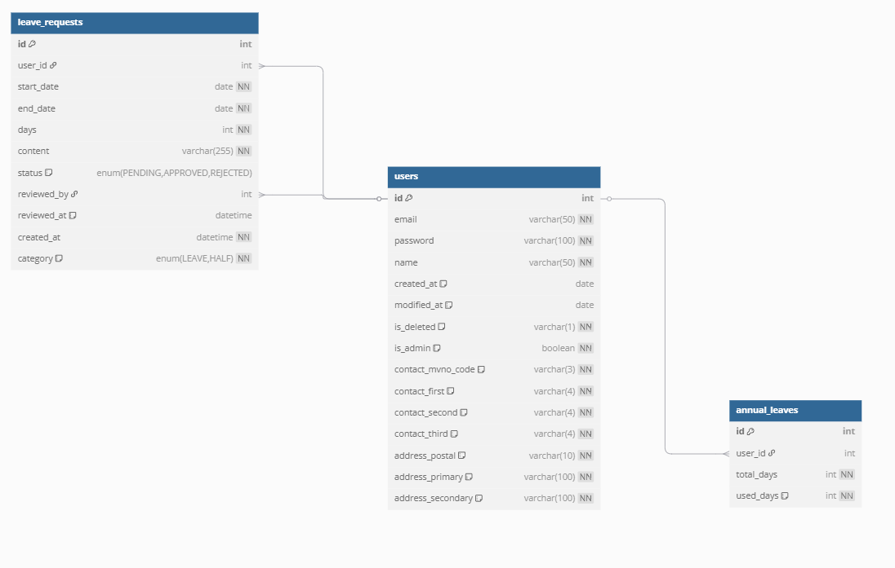

## 📊 DB 다이어그램

---

## 🗄️ Users 테이블 생성 SQL

```sql
CREATE TABLE `leave`.`users`
(
    `id`                INT UNSIGNED NOT NULL AUTO_INCREMENT,
    `email`             VARCHAR(50)  NOT NULL,
    `password`          VARCHAR(100) NOT NULL,
    `name`              VARCHAR(50)  NOT NULL,
    `created_at`        DATE DEFAULT NOW() COMMENT '입사일',
    `modified_at`       DATE         NULL COMMENT '수정일',
    `is_deleted`        VARCHAR(1) NOT NULL COMMENT '탈퇴여부 (Y,N)',
    `is_admin`          BOOLEAN NOT NULL COMMENT '관리자여부 (true,false)',
    `contact_mvno_code` VARCHAR(3)   NOT NULL COMMENT '연락처 통신사 코드 FK',
    `contact_first`     VARCHAR(4)   NOT NULL COMMENT '연락처 앞',
    `contact_second`    VARCHAR(4)   NOT NULL COMMENT '연락처 중간',
    `contact_third`     VARCHAR(4)   NOT NULL COMMENT '연락처 끝',
    `address_postal`    VARCHAR(10)  NOT NULL COMMENT '주소 우편번호',
    `address_primary`   VARCHAR(100) NOT NULL COMMENT '주소 기본',
    `address_secondary` VARCHAR(100) NOT NULL COMMENT '주소 상세',
    CONSTRAINT PRIMARY KEY (`id`),
    CONSTRAINT UNIQUE (`email`)
);
```
## 🗄️ Annual Leaves 테이블 생성 SQL
``` sql
CREATE TABLE `leave`.`annual_leaves` 
(
    `id` INT UNSIGNED NOT NULL AUTO_INCREMENT,
    `user_id` INT UNSIGNED NOT NULL,
    `total_days` INT UNSIGNED NOT NULL,           -- 총 연차 일 수
    `used_days` INT UNSIGNED NOT NULL DEFAULT 0,  -- 사용 연차 일 수

    CONSTRAINT PRIMARY KEY (`id`),
    CONSTRAINT FOREIGN KEY (`user_id`) REFERENCES `leave`.`users`(`id`)
);
```
## 🗄️ Leave Requests 테이블 생성 SQL
```sql
CREATE TABLE `leave`.`leave_requests` 
(
    `id` INT UNSIGNED NOT NULL AUTO_INCREMENT,
    `user_id` INT UNSIGNED NOT NULL,
    `start_date` DATE NOT NULL,                   -- 연차 시작일
    `end_date` DATE NOT NULL,                     -- 연차 종료일
    `days` INT UNSIGNED NOT NULL,                 -- 신청한 일 수
    `content` VARCHAR(255) NOT NULL,              -- 연차 사유
    `status` ENUM('PENDING', 'APPROVED', 'REJECTED') DEFAULT 'PENDING', -- 상태
    `reviewed_by` INT UNSIGNED NULL,              -- 검토자 ID (users FK)
    `reviewed_at` DATETIME NULL DEFAULT NULL,     -- 검토 일시
    `created_at` DATETIME NOT NULL,               -- 신청 일시
    `category` ENUM('LEAVE','HALF') NOT NULL COMMENT '연차 구분',
    CONSTRAINT PRIMARY KEY (`id`),
    CONSTRAINT FOREIGN KEY (`user_id`) REFERENCES `leave`.`users`(`id`),
    CONSTRAINT FOREIGN KEY (`reviewed_by`) REFERENCES `leave`.`users`(`id`)
);
```
## INDEX.html


## ADMIN.html


